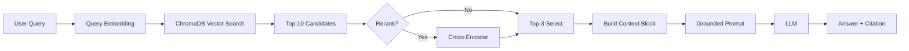

# Architecture — RAG Pipeline (Day 08 Lab)

> Template: Điền vào các mục này khi hoàn thành từng sprint.
> Deliverable của Documentation Owner.

## 1. Tổng quan kiến trúc

```
[Raw Docs]
    ↓
[index.py: Preprocess → Chunk → Embed → Store]
    ↓
[ChromaDB Vector Store]
    ↓
[rag_answer.py: Query → Retrieve → Rerank → Generate]
    ↓
[Grounded Answer + Citation]
```

**Mô tả ngắn gọn:**
Hệ thống là một trợ lý ảo nội bộ dành cho khối CS (Customer Service) và IT Helpdesk, giúp trả lời các câu hỏi về chính sách và quy trình công ty dựa trên nguồn dữ liệu tin cậy. Hệ thống giải quyết vấn đề truy xuất thông tin nhanh chóng và chính xác bằng cách kết hợp tìm kiếm ngữ nghĩa và trích dẫn bằng chứng cụ thể.

---

## 2. Indexing Pipeline (Sprint 1)

### Tài liệu được index
| File | Nguồn | Department | Số chunk |
|------|-------|-----------|---------|
| `policy_refund_v4.txt` | policy/refund-v4.pdf | CS | 6 |
| `sla_p1_2026.txt` | support/sla-p1-2026.pdf | IT | 5 |
| `access_control_sop.txt` | it/access-control-sop.md | IT Security | 8 |
| `it_helpdesk_faq.txt` | support/helpdesk-faq.md | IT | 7 |
| `hr_leave_policy.txt` | hr/leave-policy-2026.pdf | HR | 8 |

### Quyết định chunking
| Tham số | Giá trị | Lý do |
|---------|---------|-------|
| Chunk size | 400 tokens | Cân bằng giữa việc giữ đủ ngữ cảnh và tối ưu chi phí token. |
| Overlap | 80 tokens | Tránh hiện tượng mất thông tin ở ranh giới giữa các chunk. |
| Chunking strategy | Heading-based + Paragraph-based | Ưu tiên cắt theo heading để giữ logic tài liệu, sau đó cắt theo paragraph nếu section quá dài. |
| Metadata fields | source, section, effective_date, department, access | Phục vụ filter, freshness, citation |

### Embedding model
- **Model**: OpenAI text-embedding-3-small (1536 dims)
- **Vector store**: ChromaDB (PersistentClient)
- **Similarity metric**: Cosine

---

## 3. Retrieval Pipeline (Sprint 2 + 3)

### Baseline (Sprint 2)
| Tham số | Giá trị |
|---------|---------|
| Strategy | Dense (embedding similarity) |
| Top-k search | 10 |
| Top-k select | 3 |
| Rerank | Không |

### Variant (Sprint 3)
| Tham số | Giá trị | Thay đổi so với baseline |
|---------|---------|------------------------|
| Strategy | Hybrid (Dense + BM25) | Kết hợp tìm kiếm keyword để bắt alias/mã lỗi. |
| Top-k search | 10 | Giữ nguyên độ rộng tìm kiếm. |
| Top-k select | 3 | Lọc ra 3 kết quả tốt nhất sau khi merge. |
| Rerank | LLM Reranker | Sử dụng GPT-4o-mini để chấm điểm lại mức độ liên quan. |
| Query transform | None | Tạm thời giữ nguyên query gốc. |

**Lý do chọn variant này:**
Cấu hình Hybrid giúp xử lý tốt các câu hỏi chứa keyword đặc thù (như mã lỗi ERR-403) hoặc các tên tài liệu cũ (Approval Matrix). Reranking giúp loại bỏ các "noise" từ dense retrieval khi gặp tài liệu có nội dung tương đồng nhưng không đúng mục đích.

---

## 4. Generation (Sprint 2)

### Grounded Prompt Template
```
Answer only from the retrieved context below.
If the context is insufficient, say you do not know.
Cite the source field when possible.
Keep your answer short, clear, and factual.

Question: {query}

Context:
[1] {source} | {section} | score={score}
{chunk_text}

[2] ...

Answer:
```

### LLM Configuration
| Tham số | Giá trị |
|---------|---------|
| Model | gpt-4o-mini |
| Temperature | 0 (để output ổn định cho eval) |
| Max tokens | 512 |

---

## 5. Failure Mode Checklist

> Dùng khi debug — kiểm tra lần lượt: index → retrieval → generation

| Failure Mode | Triệu chứng | Cách kiểm tra |
|-------------|-------------|---------------|
| Index lỗi | Retrieve về docs cũ / sai version | `inspect_metadata_coverage()` trong index.py |
| Chunking tệ | Chunk cắt giữa điều khoản | `list_chunks()` và đọc text preview |
| Retrieval lỗi | Không tìm được expected source | `score_context_recall()` trong eval.py |
| Generation lỗi | Answer không grounded / bịa | `score_faithfulness()` trong eval.py |
| Token overload | Context quá dài → lost in the middle | Kiểm tra độ dài context_block |

---

## 6. Diagram (tùy chọn)

> TODO: Vẽ sơ đồ pipeline nếu có thời gian. Có thể dùng Mermaid hoặc drawio.


