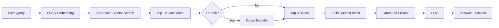

# Architecture — RAG Pipeline (Day 08 Lab)

> Template: Điền vào các mục này khi hoàn thành từng sprint.
> Deliverable của Documentation Owner.

## 1. Tổng quan kiến trúc

```
[Raw Docs]
    ↓
[index.py: Preprocess → Chunk → Embed → Store]
    ↓
[ChromaDB Vector Store]
    ↓
[rag_answer.py: Query → Retrieve → Rerank → Generate]
    ↓
[Grounded Answer + Citation]
```

**Mô tả ngắn gọn:**
> Điểm cốt lõi của RAG pipeline là biến kiến thức doanh nghiệp (các SOP, policy) vốn tĩnh lẻ tẻ thành dạng searchable ngữ nghĩa (Vector Store). Hệ thống giúp nhân sự, support team hoặc agent tra cứu theo câu hỏi thuần thục và đưa ra đáp án dựa trên context có sẵn, đính kèm Citation.

---

## 2. Indexing Pipeline (Sprint 1)

### Tài liệu được index
| File | Nguồn | Department | Số chunk |
|------|-------|-----------|---------|
| `policy_refund_v4.txt` | policy/refund-v4.pdf | CS | Tính toán tự động |
| `sla_p1_2026.txt` | support/sla-p1-2026.pdf | IT | Tính toán tự động |
| `access_control_sop.txt` | it/access-control-sop.md | IT Security | Tính toán tự động |
| `it_helpdesk_faq.txt` | support/helpdesk-faq.md | IT | Tính toán tự động |
| `hr_leave_policy.txt` | hr/leave-policy-2026.pdf | HR | Tính toán tự động |

### Quyết định chunking
| Tham số | Giá trị | Lý do |
|---------|---------|-------|
| Chunk size | 500 ký tự | Tối ưu độ dài context cho Chroma DB |
| Overlap | 50 ký tự | Đảm bảo không bị mất thông tin giữa 2 chunks |
| Chunking strategy | Token-based / Recursive | Dễ triển khai, tối ưu embedding nhanh |
| Metadata fields | source, section, effective_date, department, access | Phục vụ filter, freshness, citation |

### Embedding model
- **Model**: text-embedding-3-small (hoặc local)
- **Vector store**: ChromaDB (PersistentClient)
- **Similarity metric**: Cosine

---

## 3. Retrieval Pipeline (Sprint 2 + 3)

### Baseline (Sprint 2)
| Tham số | Giá trị |
|---------|---------|
| Strategy | Dense (embedding similarity) |
| Top-k search | 10 |
| Top-k select | 3 |
| Rerank | Không |

### Variant (Sprint 3)
| Tham số | Giá trị | Thay đổi so với baseline |
|---------|---------|------------------------|
| Strategy | Hybrid | Tích hợp Sparse Match (BM25) bắt exact keywords |
| Top-k search | 10 | Không đổi |
| Top-k select | 3 | Không đổi |
| Rerank | Cross-Encoder | Bật module reranker để đánh giá lại text chunk |
| Query transform | None | Không áp dụng |

**Lý do chọn variant này:**
> Chọn Hybrid kết hợp Rerank nhằm lấy lại được các keyword kỹ thuật và mã lỗi dễ bị embedding Dense bỏ sót, sau đó Cross-encoder sẽ đẩy thông tin relevance nhất lên top 3 để giảm nhiễu trước LLM.

---

## 4. Generation (Sprint 2)

### Grounded Prompt Template
```
Answer only from the retrieved context below.
If the context is insufficient, say you do not know.
Cite the source field when possible.
Keep your answer short, clear, and factual.

Question: {query}

Context:
[1] {source} | {section} | score={score}
{chunk_text}

[2] ...

Answer:
```

### LLM Configuration
| Tham số | Giá trị |
|---------|---------|
| Model | gpt-4o-mini |
| Temperature | 0 (để output ổn định cho eval) |
| Max tokens | 512 |

---

## 5. Failure Mode Checklist

> Dùng khi debug — kiểm tra lần lượt: index → retrieval → generation

| Failure Mode | Triệu chứng | Cách kiểm tra |
|-------------|-------------|---------------|
| Index lỗi | Retrieve về docs cũ / sai version | `inspect_metadata_coverage()` trong index.py |
| Chunking tệ | Chunk cắt giữa điều khoản | `list_chunks()` và đọc text preview |
| Retrieval lỗi | Không tìm được expected source | `score_context_recall()` trong eval.py |
| Generation lỗi | Answer không grounded / bịa | `score_faithfulness()` trong eval.py |
| Token overload | Context quá dài → lost in the middle | Kiểm tra độ dài context_block |

---

## 6. Diagram (tùy chọn)

> TODO: Vẽ sơ đồ pipeline nếu có thời gian. Có thể dùng Mermaid hoặc drawio.


